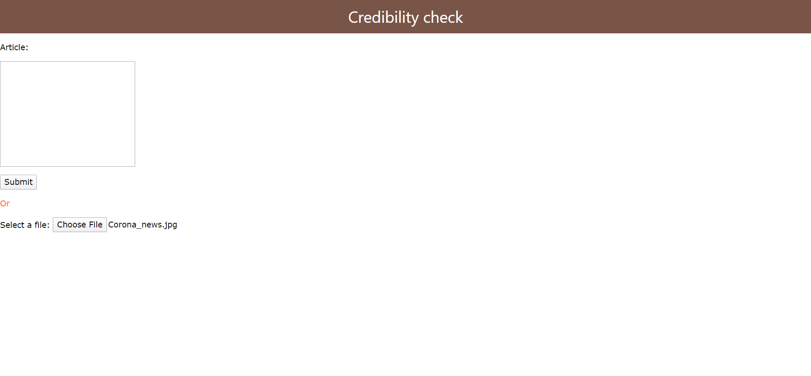
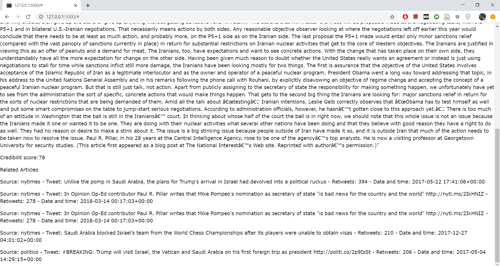
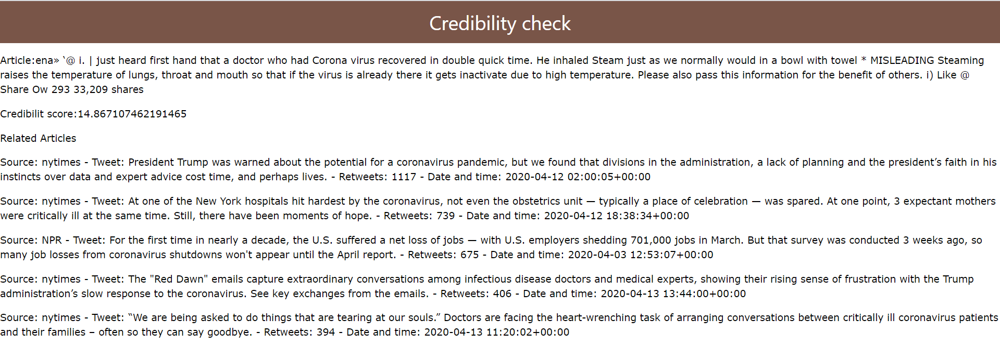

# Alithea_credibility-checker

### A web application to perform credibility check on any article. LSTM machine laerning model is trained using data from FakeNewsCorpus to generate credibility score for text articles, and to obtain relevant tweets from credible sources. Google audio and Google Tesseract were used to extract text from image and audio source.

## app.py
Connects three different functionalities.
A web framework: we used  python flask to host web pages in the local server. HTML files for this webpage are stored in template folder
Text extractor: for converting image/audio/text file into a article text string.
Trained machine learning: Helper functions for the trained ML model and article scarpper were stored in nlp.py. 

## nlp.py Alithea_model_training.py
The data from FakeNewsCorpus is preprocessed and trained on LSTM model.The trained model is stored using python pickel files.

preprocessing: data is cleaned to deal with special characters, numbers, english stopwords, line spaces, capital letters and then converted to numerical vectors using TF-IDF vectorizer.
Training: Long Short Term Memory Neural Network is used.

Tweet Scapper https://github.com/benbroks/TweetScraper is used for extracting relevant tweets for the given article

## img_audio.py
This program contains logic to extract article text from Image/Audio data. We used Tesseract, google audio API for extracting the text.

## Example

### main page
The mainpage of our application looks like this.

we can either write the article in the text field of upload article in .txt/.jpg/.wav file formats.

### credible source
credible source is present in Examples/Text_credible.txt
The output for the given article is shown below

### fake source
An image from a fake article 

This is the output of the fake article

